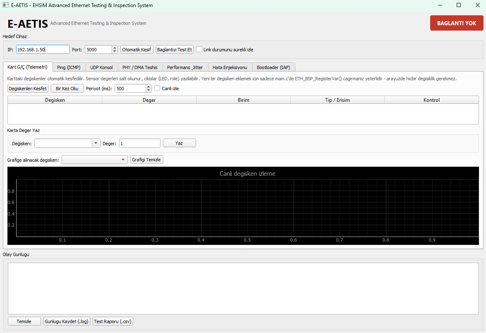

# Ethernet_BSP — E-AETIS

Taşınabilir, bare-metal STM32 Ethernet Board Support Package (BSP). RTOS yok, LwIP yok — yalnızca CMSIS register erişimi ve DMA descriptor ring yönetimi. Yanında, kartla UDP üzerinden konuşan bir masaüstü test/teşhis arayüzü (**E-AETIS GUI**) gelir.

## İçindekiler

- [Genel Bakış](#genel-bakış)
- [Desteklenen Donanım](#desteklenen-donanım)
- [Proje Yapısı](#proje-yapısı)
- [Hızlı Başlangıç](#hızlı-başlangıç)
- [Entegrasyon (Detaylı)](#entegrasyon-detaylı)
- [Yapılandırma — `eth_config.h`](#yapılandırma--eth_configh)
- [Kullanım Örnekleri](#kullanım-örnekleri)
- [Kullanıcı API'si — `eth_app.h`](#kullanıcı-apisi--eth_apph)
- [Mimari](#mimari)
- [Yeni MCU / MAC Ailesi / PHY Eklemek](#yeni-mcu--mac-ailesi--phy-eklemek)
- [Bootloader (IAP) Entegrasyonu — Detaylı](#bootloader-iap-entegrasyonu--detaylı)
- [E-AETIS Protokolü (UDP)](#e-aetis-protokolü-udp)
- [E-AETIS GUI Aracı](#e-aetis-gui-aracı)
- [Karta Yüklemeden Önce Doğrulama Listesi](#karta-yüklemeden-önce-doğrulama-listesi)
- [Bilinen Sınırlar](#bilinen-sınırlar)
- [Bilinen Depo Sorunları](#bilinen-depo-sorunları)

## Genel Bakış

**E-AETIS** (Advanced Ethernet Testing & Inspection System), Ethernet BSP'nin performansını doğrulamak, ping/ICMP testleri koşmak, kart değişkenlerini gerçek zamanlı izlemek ve IAP bootloader işlemlerini yönetmek için tasarlanmış bir masaüstü test ve telemetri arayüzüdür.

<p align="center">
  
</p>

**Öne çıkan özellikler:**
- **Kart I/O ve Telemetri:** Otomatik değişken keşfi ve gerçek zamanlı izleme.
- **Ağ Testleri:** Ping (ICMP) testi, UDP konsol loglama, performans/jitter analizi.
- **Teşhis:** PHY / DMA teşhisi ve hata enjeksiyonu (fault injection) modülleri.
- **Firmware Güncelleme:** Entegre Bootloader (IAP) yönetimi.

**Bu kütüphaneyi ne zaman seçmeli?** Register seviyesinde ne olup bittiğini görmek istediğin, statik bellek dışında hiçbir şey istemediğin veya HAL/LwIP/RTOS ailelerinin taşınabilirlik sorunlarından kaçınmak istediğin projelerde. TCP, DHCP, DNS veya IP fragment reassembly gerekiyorsa (bkz. [Bilinen Sınırlar](#bilinen-sınırlar)) bu kütüphane uygun değildir — LwIP gibi tam bir yığın kullanılmalıdır.

## Desteklenen Donanım

Hedef MCU ve PHY, `eth_config.h` içinden derleme zamanında **tam olarak bir tanesi** seçilerek belirlenir (`eth_device.h` seçimi doğrular, birden fazla veya hiç seçim yoksa derleme `#error` ile durur).

| Kategori | Desteklenenler | Port katmanı |
|---|---|---|
| MCU | STM32H563, STM32H743 | Synopsys DWC EQOS (`eth_port_eqos.c`) |
| MCU | STM32F407, STM32F767 | Klasik ST/DWC GMAC 3.x (`eth_port_gmac.c`) |
| PHY | LAN8720A, LAN8742A | `eth_phy_lan87xx.c` |
| PHY | KSZ8081 | `eth_phy_ksz80xx.c` |

`eth_config.h`'deki RMII pin haritası varsayılan olarak NUCLEO-H563ZI atamalarını içerir — kendi kart şemanıza göre doğrulanmalı/güncellenmelidir.

Register alan yerleşimlerini doğrulamak için gereken üretici belgelerinin listesi ve kod↔belge eşlemesi için bkz. [`Docs/REFERENCE_MANUALS.md`](Docs/REFERENCE_MANUALS.md).

## Proje Yapısı

```
Ethernet_BSP/
├── Inc/
│   ├── eth_config.h      # Kullanıcının düzenlediği TEK dosya
│   ├── eth_app.h          # Uygulamanın include ettiği TEK başlık (kullanıcı API'si)
│   ├── eth_device.h       # MCU → MAC ailesi + yetenek eşlemesi (dokunulmaz)
│   ├── eth_driver.h       # Ortak tipler (ETH_Status_t, ETH_Stats_t...) ve çekirdek driver API'si
│   ├── eth_port.h          # MAC ailesi port sözleşmesi — 21 fonksiyon (dokunulmaz)
│   ├── eth_phy.h           # PHY sözleşmesi — 4 fonksiyon (dokunulmaz)
│   └── eth_iap.h           # IAP bootloader sözleşmesi — 4 fonksiyon (opsiyonel, dokunulmaz)
├── Src/
│   ├── eth_driver.c        # Ring yönetimi, sahiplik protokolü, istatistik — register erişimi yok
│   ├── eth_app.c           # ARP / ICMP / UDP / E-AETIS komut işleyicisi
│   ├── eth_iap.c            # IAP bootloader (opsiyonel, `ETH_ENABLE_IAP`)
│   ├── port/
│   │   ├── eth_port_eqos.c  # H5 / H7 register erişimi
│   │   └── eth_port_gmac.c  # F4 / F7 register erişimi
│   └── phy/
│       ├── eth_phy_lan87xx.c
│       └── eth_phy_ksz80xx.c
├── Examples/
│   └── main.c               # Uçtan uca entegrasyon örneği (telemetri değişkenleri, LED getter/setter)
├── Docs/
│   ├── linker_snippet.ld    # `.eth_desc` section'ı için linker script eklentisi
│   ├── REFERENCE_MANUALS.md # MCU/PHY üretici referans belgeleri — kod↔belge eşlemesi
│   └── gui.png
├── arayuz_gelisim_ekran_goruntuleri/  # GUI'nin gelişim sürecine ait ekran görüntüleri (kütüphanenin parçası değil)
└── ethernet_test_gui.py     # E-AETIS masaüstü GUI (PyQt5)
```

Aşağıdaki tablo her dosyanın görevini ve **kimin dokunması gerektiğini** özetler. "Dokunulmaz" olarak işaretlenen dosyalar kütüphanenin iç uygulama detayıdır; entegrasyon sırasında bunları değiştirmeniz gerekmez.

| Dosya | Dokunulur mu? | Görevi |
|---|---|---|
| `Inc/eth_config.h` | ✅ Evet — tek düzenlenen dosya | Hedef MCU/PHY seçimi, MAC/IP adresi, RMII pin haritası, DMA/bellek boyutları, özellik anahtarları, debug ayarı. |
| `Inc/eth_app.h` | 🟡 Include edilir | Uygulama kodunun dokunduğu tek başlık; tüm kullanıcı API'sini (`ETH_BSP_*`) tanımlar. |
| `Inc/eth_device.h` | ⛔ Dokunulmaz | MCU → MAC ailesi + yetenek eşlemesi; derleme zamanı sağlık kontrolleri. |
| `Inc/eth_driver.h` | ⛔ Dokunulmaz | Ortak tipler (`ETH_Status_t`, `ETH_Desc_t`, `ETH_LinkState_t`, `ETH_Stats_t`) ve çekirdek driver bildirimleri. |
| `Inc/eth_port.h` | ⛔ Dokunulmaz | MAC ailesi port sözleşmesi — 21 fonksiyon imzası. |
| `Inc/eth_phy.h` | ⛔ Dokunulmaz | PHY sözleşmesi — `Bringup`/`GetSpeedDuplex`/`SetLoopback`/`GetName`. |
| `Inc/eth_iap.h` | ⛔ Dokunulmaz (opsiyonel) | IAP bootloader sözleşmesi — 4 fonksiyon imzası. |
| `Src/eth_driver.c` | ⛔ Dokunulmaz | DMA descriptor ring yönetimi, OWN biti sahiplik protokolü, istatistik toplama — tek bir register erişimi içermez. |
| `Src/eth_app.c` | ⛔ Dokunulmaz | Gelen paketleri ayrıştırıp ARP/ICMP/UDP/E-AETIS işleyicilerine yönlendirir. |
| `Src/eth_iap.c` | ⛔ Dokunulmaz (opsiyonel) | IAP implementasyonu: flash silme/yazma, CRC32 doğrulama, atlama mekanizması. |
| `Src/port/eth_port_eqos.c` | ⛔ Dokunulmaz | H5/H7 (Synopsys DWC EQOS) register erişimi. |
| `Src/port/eth_port_gmac.c` | ⛔ Dokunulmaz | F4/F7 (klasik GMAC) register erişimi. |
| `Src/phy/eth_phy_lan87xx.c` | ⛔ Dokunulmaz | LAN8720A / LAN8742A sürücüsü. |
| `Src/phy/eth_phy_ksz80xx.c` | ⛔ Dokunulmaz | KSZ8081 sürücüsü. |
| `Examples/main.c` | 📖 Referans | Uçtan uca entegrasyon örneği — kopyalayıp kendi projene uyarlayabilirsin. |
| `Docs/linker_snippet.ld` | 📋 Uygulanır | `.eth_desc` section'ının linker script'e nasıl ekleneceğinin şablonu. |
| `Docs/REFERENCE_MANUALS.md` | 📖 Referans | MCU/PHY üretici belgeleri listesi + kod↔belge bölüm eşlemesi (register doğrulama için). |
| `ethernet_test_gui.py` | 🔧 Ayrı çalıştırılır | E-AETIS masaüstü test arayüzünün kaynak kodu (PyQt5). |

## Hızlı Başlangıç

Deneyimli bir geliştirici için minimum adımlar:

```bash
# 1) Kütüphaneyi kopyala
cp -r Ethernet_BSP/Inc  <proje>/Inc
cp -r Ethernet_BSP/Src  <proje>/Src
```

```c
// 2) eth_config.h içinde hedef MCU ve PHY'yi seç, MAC/IP ayarla (bkz. Yapılandırma)

// 3) main.c
#include "eth_app.h"

int main(void) {
    HAL_Init();
    SystemClock_Config();          // 50 MHz RMII referans saati aktif olmalı

    if (ETH_BSP_Init() != ETH_OK) { /* hata kodu nedeni söyler */ }

    while (1) {
        ETH_BSP_ProcessEvents();   // bloklamaz
        // kendi uygulama kodun
    }
}
```

```bash
# 4) GUI ile test et
pip install PyQt5
python ethernet_test_gui.py
```

Aşağıdaki bölümler her adımı detaylandırır.

## Entegrasyon (Detaylı)

Bu bölüm, kütüphaneyi **sıfırdan kendi STM32 projenize** (STM32CubeIDE, STM32CubeMX + Makefile/CMake, veya elle yazılmış bir toolchain) dahil etmek için gereken tüm adımları, hangi araçla çalışıyor olursanız olun uygulanabilecek şekilde anlatır.

### 1. Dosyaları kopyalayın ve build sistemine tanıtın

`Ethernet_BSP/Inc/` ve `Ethernet_BSP/Src/` klasörlerini projenize kopyalayın (`Examples/`, `Docs/`, `ethernet_test_gui.py` ve `arayuz_gelisim_ekran_goruntuleri/` kopyalanmaz — bunlar kütüphanenin derlenen bir parçası değildir).

```bash
cp -r Ethernet_BSP/Inc  <projeniz>/Ethernet_BSP/Inc
cp -r Ethernet_BSP/Src  <projeniz>/Ethernet_BSP/Src
```

`Src/` altındaki **tüm** `.c` dosyalarını (port ve PHY dosyaları dahil) build path'e ekleyin. Seçilmeyen port/PHY dosyaları boş derlenir (ilgili `#if ETH_PORT_XXX` / `#if defined(ETH_PHY_XXX)` bloğu devre dışı kalır) — elle çıkarmanıza gerek yoktur.

- **STM32CubeIDE:** Klasörü projeye sürükleyip "Copy files" ile ekleyin (veya "Link to files"), ardından proje sağ tık → *Properties → C/C++ Build → Settings → Include Paths* içine `Ethernet_BSP/Inc` ekleyin. Proje otomatik olarak `Src/` altındaki tüm `.c` dosyalarını derlemeye dahil eder.
- **CMake:**
  ```cmake
  file(GLOB_RECURSE ETH_BSP_SOURCES
      ${CMAKE_SOURCE_DIR}/Ethernet_BSP/Src/*.c
  )
  target_sources(${PROJECT_NAME} PRIVATE ${ETH_BSP_SOURCES})
  target_include_directories(${PROJECT_NAME} PRIVATE
      ${CMAKE_SOURCE_DIR}/Ethernet_BSP/Inc
  )
  ```
- **Elle yazılmış Makefile:** `Ethernet_BSP/Src` ve alt klasörlerini `C_SOURCES` listenize, `Ethernet_BSP/Inc`'i `C_INCLUDES` listenize ekleyin.

Kütüphane CMSIS başlıklarına (`stm32h5xx.h` vb.) ihtiyaç duyar; bunlar CubeMX/CubeIDE tarafından projeye zaten dahil edilmiş olmalıdır.

**Önemli — HAL'in kendi ETH sürücüsüyle çakışma:** CubeMX ile proje oluşturduysanız ve Ethernet periferiğini CubeMX arayüzünden de etkinleştirdiyseniz, CubeMX `stm32xxxx_hal_msp.c` içine kendi `HAL_ETH_MspInit()` fonksiyonunu ve NVIC IRQ'sunu üretir. Bu kütüphane HAL'in ETH sürücüsünü **kullanmaz**, kendi register erişimini yapar. Çakışmayı önlemek için:
1. CubeMX `.ioc` dosyasında Ethernet periferiğini **Disabled** bırakın (RMII pinlerini kendi `eth_config.h` haritanızla eşleştireceğiniz için CubeMX'in GPIO/AF ataması gerekmez).
2. Varsa üretilen `HAL_ETH_MspInit`/`ETH_IRQHandler` fonksiyonlarını projeden çıkarın veya boş bırakın.
3. `stm32xxxx_hal_conf.h` içinde `HAL_ETH_MODULE_ENABLED` tanımlı olsa bile sorun değildir (bu kütüphane onu kullanmaz), ama iki farklı kod yolunun aynı registerlara aynı anda yazmasını önlemek için CubeMX'in ETH init kodunu **çağırmayın**.

### 2. `eth_config.h` dosyasını düzenleyin

Bu, elle değiştirmeniz gereken **tek** dosyadır (bkz. [Yapılandırma](#yapılandırma--eth_configh)): hedef MCU, PHY çipi, IP/MAC, RMII pin haritası, PHY adresi. `eth_device.h` yanlış/eksik/çakışan seçimlerde derlemeyi `#error` ile durdurur, bu yüzden hatalar derleme anında yakalanır.

RMII pin haritasını **kendi kart şemanızdan** doğrulayın — varsayılan değerler NUCLEO-H563ZI'ye özgüdür ve başka bir kartta çalışmaz.

### 3. Linker script'e `.eth_desc` section'ını ekleyin

DMA descriptor'ları, DMA'nın erişebildiği ve MPU tarafından non-cacheable işaretlenen özel bir bellek bölgesinde tutulmalıdır. `Docs/linker_snippet.ld` dosyasındaki şablonu kullanıp bölgenin adresini `eth_config.h`'deki `ETH_DESC_REGION_BASE`/`ETH_DESC_REGION_SIZE` ile eşleştirin.

Uygulamada:
1. `.ld` dosyanızdaki `MEMORY` bloğuna `RAM_DESC` bölgesini ekleyin (adres/boyut, `Docs/linker_snippet.ld` içindeki MCU örneklerine bakın).
2. `SECTIONS` bloğuna `.eth_desc (NOLOAD)` section'ını ekleyip `>RAM_DESC` ile bu bölgeye yerleştirin.
3. `eth_config.h`'deki `ETH_DESC_REGION_BASE` ve `ETH_DESC_REGION_SIZE` değerlerini `RAM_DESC`'in `ORIGIN`/`LENGTH` değerleriyle **birebir eşleştirin** — uyuşmazlık, MPU'nun yanlış bölgeyi non-cacheable işaretlemesine ve DMA'nın gördüğü verinin CPU cache'iyle tutarsız kalmasına (cache coherency hatası) yol açar.

> **H7 notu:** Descriptor bölgesi DTCM'de (`0x20000000`) olamaz — ETH DMA oraya erişemez; D2 domain SRAM (`0x30000000`) kullanılmalıdır. `eth_device.h` bunu derleme zamanında zorlar.

### 4. `main.c` içinde başlatın

Tek başlığı include edip `ETH_BSP_Init()` çağırın, ardından ana döngüde `ETH_BSP_ProcessEvents()`'i sürekli çağırın (Hızlı Başlangıç'taki kod örneğine bakın). Bu fonksiyon bloklamaz; her çağrıda en fazla bir miktar bekleyen paketi işler.

`ETH_BSP_Init()` çağrılmadan önce `SystemClock_Config()` çağrılmış ve 50 MHz RMII referans saati aktif olmalıdır — aksi halde `ETH_ERR_TIMEOUT` alınır.

Başlatma başarısız olursa hata kodu doğrudan nedeni söyler:

| Hata kodu | Anlamı | Önerilen aksiyon |
|---|---|---|
| `ETH_ERR_TIMEOUT` | 50 MHz RMII referans saati gelmiyor | Saat ağacı / PHY osilatörü kontrol edin |
| `ETH_ERR_PHY` | PHY yanıt vermiyor, `PHY_ADDRESS` yanlış olabilir | `ETH_PHY_ScanAddress()` ile doğru adresi bulun |
| `ETH_ERR_LINK_DOWN` | Fiziksel bağlantı yok | Kabloyu / link LED'ini kontrol edin |

### 5. Kendi değişkenlerinizi ve komutlarınızı arayüze açın

Bkz. [Kullanım Örnekleri](#kullanım-örnekleri) — `ETH_BSP_RegisterVar()`, `ETH_BSP_RegisterUDPCallback()`, `ETH_BSP_RegisterCommandHandler()`.

### 6. Karta yüklemeden önce doğrulayın

Bkz. [Karta Yüklemeden Önce Doğrulama Listesi](#karta-yüklemeden-önce-doğrulama-listesi) ve [`Docs/REFERENCE_MANUALS.md`](Docs/REFERENCE_MANUALS.md).

### 7. E-AETIS GUI ile uçtan uca test edin

Bkz. [E-AETIS GUI Aracı](#e-aetis-gui-aracı).

### 8. (Opsiyonel) Ağdan firmware güncelleme ekleyin

Bkz. [Bootloader (IAP) Entegrasyonu — Detaylı](#bootloader-iap-entegrasyonu--detaylı). Bu adım ayrı bir proje yapısı (bootloader + uygulama ikili derleme) gerektirdiğinden ayrı bir bölümde ele alınmıştır.

Uçtan uca çalışan bir örnek (sıcaklık/besleme telemetrisi + I2C nem sensörü + arayüzden kontrol edilebilir LED) için [`Examples/main.c`](Examples/main.c) dosyasına bakın.

## Yapılandırma — `eth_config.h`

Bu dosya `eth_config.h`'nin **tek elle düzenlenen** dosya olduğu prensibiyle, tüm kullanıcı ayarlarını sekiz grupta toplar:

| # | Grup | İçerik |
|---|---|---|
| 1 | Hedef işlemci | `ETH_TARGET_STM32H563` / `H743` / `F407` / `F767` (sadece biri) |
| 2 | PHY çipi | `ETH_PHY_LAN8720A` / `LAN8742A` / `KSZ8081` (sadece biri) |
| 3 | Ağ kimliği | MAC adresi (6 bayt), IP, netmask, gateway |
| 4 | PHY ayarları | `PHY_ADDRESS`, donanım reset pini, auto-negotiation timeout |
| 5 | RMII pin haritası | Her RMII sinyali için port/pin + `ETH_GPIO_CLOCK_MASK` |
| 6 | DMA / bellek | RX/TX descriptor sayısı (2'nin kuvveti), buffer boyutu, descriptor bölgesi adresi/boyutu, `ETH_HCLK_HZ` |
| 7 | Özellik anahtarları | ARP/ICMP/UDP/istatistik/E-AETIS komut/kullanıcı komut/telemetri/IAP aç-kapa, `ETH_EAETIS_PORT` |
| 8 | Hata ayıklama | `ETH_DEBUG_ENABLE` |

`eth_device.h`, derleme zamanında sağlık kontrolleri yapar: descriptor sayılarının 2'nin kuvveti olması, buffer boyutunun ≥1524 ve 4'ün katı olması, descriptor+buffer toplamının ayrılan bölgeye sığması, ve D-Cache'li hedeflerde MPU non-cacheable ayarının açık olması (`#error` / `#warning` ile).

> **H7 notu:** Descriptor bölgesi DTCM'de (`0x20000000`) olamaz — ETH DMA oraya erişemez; D2 domain SRAM (`0x30000000`) kullanılmalıdır. `eth_device.h` bunu derleme zamanında zorlar.

## Kullanım Örnekleri

### 1) Salt-okunur bir sensör değişkenini arayüze açmak (pull, doğrudan bellek)

Değer, ana döngüde güncellenen düz bir değişkense `ptr` alanını kullanın. Yapı programın ömrü boyunca geçerli kalmalı, bu yüzden `static const` tanımlanır — BSP yapıyı kopyalamaz, yalnızca işaretçisini saklar.

```c
static float g_temperature_c = 0.0f;

static const ETH_Var_t var_temp = {
    .name = "sicaklik", .unit = "C", .type = ETH_VAR_F32,
    .writable = false, .ptr = &g_temperature_c
};

/* main() içinde, ETH_BSP_Init()'ten sonra bir kere: */
ETH_BSP_RegisterVar(&var_temp);

/* ana döngüde: */
g_temperature_c = ReadTemperatureSensor();
/* Arayüz bunu GET_VARS ile otomatik keşfeder ve okur — ayrıca bir şey göndermeye gerek yok. */
```

### 2) Yan etkisi olan bir değişkeni açmak (GPIO gibi — getter/setter)

Yazma işlemi donanıma dokunuyorsa (örn. bir GPIO'yu sürmek), `ptr` yerine `getter`/`setter` fonksiyon çifti kullanılır:

```c
static float led_get(void) {
    return (LED_GPIO_Port->ODR & LED_Pin) ? 1.0f : 0.0f;
}

static void led_set(float v) {
    if (v >= 0.5f) LED_GPIO_Port->BSRR = LED_Pin;
    else           LED_GPIO_Port->BSRR = (uint32_t)LED_Pin << 16;
}

static const ETH_Var_t var_led = {
    .name = "led", .unit = NULL, .type = ETH_VAR_U8,
    .writable = true, .ptr = NULL,
    .getter = led_get, .setter = led_set
};

ETH_BSP_RegisterVar(&var_led);
```

### 3) Kendi UDP portunuza gelen veriyi işlemek

BSP'nin tanımadığı bir porta (E-AETIS'in kullandığı `ETH_EAETIS_PORT` dışında) veri geldiğinde kendi işleyicinizi çağırmak için:

```c
static void MyUdpHandler(const uint8_t *data, uint16_t len,
                          uint32_t src_ip, uint16_t src_port)
{
    /* kendi ikili/metin protokolünüzü burada ayrıştırın */
}

ETH_BSP_RegisterUDPCallback(MyUdpHandler);
```

### 4) BSP'nin tanımadığı E-AETIS komutlarını yönlendirmek

E-AETIS GUI'den gelen, kütüphanenin yerleşik tanımadığı komutları (örneğin özel bir röle komutu) kendi donanımınıza yönlendirmek için:

```c
static bool MyCommandHandler(const char *cmd, char *reply, uint16_t reply_cap)
{
    if (strcmp(cmd, "RELE_AC") == 0) {
        HAL_GPIO_WritePin(RELE_GPIO_Port, RELE_Pin, GPIO_PIN_SET);
        snprintf(reply, reply_cap, "RELE_OK");
        return true;
    }
    return false;  /* tanınmayan komut */
}

ETH_BSP_RegisterCommandHandler(MyCommandHandler);
```

### 5) Karttan arayüze veri göndermek (push telemetri)

Arayüz `TELEMETRY_SUB|PORT:n` ile abone olduktan sonra, kart kendi inisiyatifiyle veri gönderebilir:

```c
if (ETH_BSP_TelemetryReady()) {
    ETH_BSP_SendTelemetry(payload, payload_len);
}
```

Daha uzun, uçtan uca bir örnek (I2C üzerinden nem sensörü okuma dahil) için [`Examples/main.c`](Examples/main.c) dosyasına bakın.

## Kullanıcı API'si — `eth_app.h`

Uygulama kodunun dokunduğu tek başlık. Öne çıkan fonksiyonlar:

| Fonksiyon | Amaç |
|---|---|
| `ETH_BSP_Init()` | BSP'yi `eth_config.h` ayarlarıyla başlatır. |
| `ETH_BSP_ProcessEvents()` | Ana döngüde sürekli çağrılır; gelen paketleri işler, bloklamaz. |
| `ETH_BSP_SendUDP()` / `ETH_BSP_ReplyUDP()` | UDP datagram gönderir (ARP çözümü otomatik). |
| `ETH_BSP_RegisterUDPCallback()` | Kendi UDP portunuza gelen veriyi almak için kaydolun. |
| `ETH_BSP_RegisterCommandHandler()` | E-AETIS arayüzünden gelen, BSP'nin tanımadığı komutları (LED, sensör vb.) kendi donanımınıza yönlendirir. |
| `ETH_BSP_SendTelemetry()` / `ETH_BSP_TelemetryReady()` | Kart tarafından tetiklenen (push) telemetri; arayüz abone olduktan sonra kullanılır. |
| `ETH_BSP_RegisterVar()` / `ETH_BSP_GetVarCount()` | Arayüzün sorup kartın cevapladığı (pull) değişkenleri (`ETH_Var_t`) kaydeder; GUI `GET_VARS` ile otomatik keşfeder. |
| `ETH_BSP_GetLinkState()` / `ETH_BSP_GetStats()` / `ETH_BSP_GetIPAddress()` | Bağlantı durumu, istatistikler, kendi IP adresi. |

`ETH_Var_t` iki kullanım biçimini destekler: doğrudan bellek erişimi (`ptr`, sensör değişkenleri için) veya fonksiyon üzerinden (`getter`/`setter`, GPIO gibi yan etkisi olan işlemler için). Yapı, ömrü boyunca geçerli kalmalıdır (`static const` olarak tanımlanmalı) — BSP yapıyı kopyalamaz, işaretçisini saklar.

## Mimari

Üç **bağımsız** eksen vardır. Birinde yapılan değişiklik diğerlerini etkilemez.

```
eth_config.h            Kullanıcının dokunduğu tek dosya
    │
eth_device.h            MCU → MAC ailesi + yetenek eşlemesi
    │
    ├── eth_port.h      Port sözleşmesi (21 fonksiyon)
    │     ├── eth_port_eqos.c    Synopsys DWC EQOS   → H5, H7
    │     └── eth_port_gmac.c    Klasik ST/DWC 3.x   → F4, F7
    │
    ├── eth_phy.h       PHY sözleşmesi (4 fonksiyon)
    │     ├── eth_phy_lan87xx.c  LAN8720A, LAN8742A
    │     └── eth_phy_ksz80xx.c  KSZ8081
    │
    ├── eth_driver.c    Ring, sahiplik protokolü, istatistik
    │                   → tek bir register erişimi içermez
    │
    └── eth_app.c       ARP / ICMP / UDP / E-AETIS komutları
          └── eth_iap.c IAP bootloader (opsiyonel)
```

## Yeni MCU / MAC Ailesi / PHY Eklemek

**Yeni MCU:** `eth_device.h` içine bir blok eklemek yeterlidir:

```c
#elif defined(ETH_TARGET_STM32F429)
  #include "stm32f4xx.h"
  #define ETH_PORT_EQOS         0
  #define ETH_PORT_GMAC         1
  #define ETH_HAS_DCACHE        0
  #define ETH_RMII_VIA_SYSCFG_PMC 1
  #define ETH_GPIO_RCC_REG      (RCC->AHB1ENR)
  #define ETH_DEVICE_NAME       "STM32F429"
```

MAC ailesi (EQOS veya GMAC) zaten destekleniyorsa **başka hiçbir dosya değişmez.**

**Yeni MAC ailesi:** `eth_port.h`'deki 21 fonksiyonu yeni bir `.c` dosyasında implemente edin, tamamını `#if ETH_PORT_XXX ... #endif` içine alın.

**Yeni PHY:** `eth_phy.h`'deki 4 fonksiyonu (`Bringup`, `GetSpeedDuplex`, `SetLoopback`, `GetName`) yeni bir dosyada implemente edin. PHY, MAC ailesinden bağımsız bir eksendir.

## Bootloader (IAP) Entegrasyonu — Detaylı

`eth_iap.c`, E-AETIS GUI'nin **Bootloader (IAP)** sekmesinden ağ üzerinden yeni bir uygulama ikilisi (firmware) yükleyip flash'a yazmayı ve CRC32 ile doğrulamayı sağlar. Bu, klasik bir "bootloader + uygulama" ikili bölüntüsüdür ve tek bir proje/tek bir `.bin` ile çalışmaz — **iki ayrı derleme çıktısı** gerektirir.

### 0. Kavram: neden iki ayrı proje gerekiyor?

- **Bootloader imajı:** `ETH_ENABLE_IAP=1` ile derlenmiş, `Ethernet_BSP`'yi içeren, flash'ın **başında** (`0x08000000`'dan itibaren) yaşayan küçük bir program. Görevi: açılışta çalışmak, Ethernet üzerinden `START_IAP`/`FW_DATA`/`END_IAP` komutlarını dinlemek, gelen firmware'i flash'a yazmak, ve bitince **uygulamaya atlamak**.
- **Uygulama imajı:** Sizin asıl projeniz (LED yakma, sensör okuma, her ne ise). Bu imaj, flash'ta bootloader'ın **bittiği adresten** (`ETH_IAP_APP_BASE_ADDR`, varsayılan `0x08020000`) itibaren başlayacak şekilde derlenir ve GUI üzerinden IAP ile yüklenir.

Bootloader kendi kendini asla üzerine yazmaz; yalnızca `ETH_IAP_APP_BASE_ADDR`'den itibaren olan bölgeyi siler/yazar. Bu yüzden bootloader'ın **kendisi** normal ST-Link/JTAG ile (bir kere) flash'lanır; ondan sonraki tüm güncellemeler ağdan, uygulama bölgesine yapılır.

### 1. Bootloader imajını hazırlama

1. `eth_config.h` içinde `ETH_ENABLE_IAP` değerini `1U` yapın.
2. `ETH_IAP_APP_BASE_ADDR` değerini belirleyin — bu, bootloader'ınıza ayırdığınız flash alanının **hemen sonrası** olmalıdır. Varsayılan `0x08020000`, `FLASH_BASE = 0x08000000`'dan itibaren **128 KB**'lık bir bootloader alanı ayırır. Bootloader binary'niz derlendikten sonra boyutunu kontrol edin (`arm-none-eabi-size`); 128 KB'a sığmıyorsa `ETH_IAP_APP_BASE_ADDR`'yi büyütün (ve sektör sınırına hizalayın — H563'te 8 KB'lık sektörler, yani adres `0x2000` katı olmalı).
3. `ETH_IAP_MAX_SIZE` değerini, uygulama imajınıza ayırdığınız kalan flash alanına göre ayarlayın (`toplam flash - ETH_IAP_APP_BASE_ADDR ofseti`). Bu değer aşılırsa `ETH_IAP_Begin()` `ETH_ERR_PARAM` döner.
4. `ETH_IAP_CHUNK_SIZE` (varsayılan 512 bayt), GUI'nin her `FW_DATA` paketinde göndereceği maksimum ikili veri miktarıdır; UDP paket boyutu sınırları içinde kalmalıdır — değiştirmeniz gerekmez.
5. Bootloader `main()`'i, normal `ETH_BSP_Init()` + `ETH_BSP_ProcessEvents()` döngüsünü çalıştırır (bkz. [Hızlı Başlangıç](#hızlı-başlangıç)); IAP komutları zaten `eth_app.c` içinde otomatik olarak işlenir, ekstra kod yazmanıza gerek yoktur.
6. Bootloader'ın **kendi linker script'i**, `FLASH` bölgesinin `ORIGIN = 0x08000000` ve `LENGTH = <ETH_IAP_APP_BASE_ADDR ofseti>` olacak şekilde sınırlandığından emin olun (bootloader'ın kendi kodu yanlışlıkla uygulama bölgesine taşmamalı).

> **Şu an yalnızca STM32H563 desteklenir.** `Src/eth_iap.c`, tek banka + 8 KB sektör + 128-bit (quad-word) flash programlama mantığıyla yalnızca H563 için yazılmıştır; başka bir hedefte `ETH_ENABLE_IAP=1` yaparsanız derleme `#error` ile durur. H743/F407/F767 için IAP eklemek isterseniz, ilgili MCU'nun flash controller'ına özgü `flash_unlock`/`flash_erase_sector`/`flash_program_*` fonksiyonlarını (bkz. [`Docs/REFERENCE_MANUALS.md`](Docs/REFERENCE_MANUALS.md) → "Embedded Flash memory" bölümü) aynı dosyaya `#if defined(ETH_TARGET_XXX)` altında eklemeniz gerekir — `eth_iap.h` sözleşmesi (4 fonksiyon) değişmez.

### 2. Uygulama imajını hazırlama

Uygulama, bootloader'dan **tamamen ayrı** bir proje/derleme hedefidir (isterseniz `Ethernet_BSP`'yi bu projeye de dahil edip `ETH_ENABLE_IAP=0` bırakarak kendi Ethernet haberleşmenizi sürdürebilirsiniz, ya da Ethernet'siz sıradan bir uygulama olabilir).

1. **Linker script:** `FLASH` bölgesinin `ORIGIN`'ini bootloader ile **birebir aynı** `ETH_IAP_APP_BASE_ADDR` değerine ayarlayın (örn. `ORIGIN = 0x08020000`). `LENGTH`, kalan flash alanı kadar olmalıdır.
   ```ld
   MEMORY
   {
     FLASH (rx) : ORIGIN = 0x08020000, LENGTH = 1920K   /* 2MB - 128K bootloader */
     RAM   (rw) : ORIGIN = 0x20008000, LENGTH = 608K
   }
   ```
2. **Vektör tablosu taşıma (`VTOR`):** Uygulamanın kendi başlangıç kodu (`SystemInit()` veya `main()`'in en başı), `SCB->VTOR` register'ını uygulamanın **kendi** vektör tablosu adresine (`ETH_IAP_APP_BASE_ADDR`) ayarlamalıdır. CubeMX ile üretilen projelerde bu genellikle `system_stm32xxxx.c` içindeki `VECT_TAB_OFFSET` makrosuyla yapılır:
   ```c
   /* system_stm32h5xx.c */
   #define VECT_TAB_SRAM
   #define VECT_TAB_OFFSET  0x00020000UL   /* ETH_IAP_APP_BASE_ADDR ile ayni */
   ```
   Bootloader zaten atlamadan hemen önce `SCB->VTOR`'u ayarlar (`ETH_IAP_JumpToApplication()` içinde), ancak uygulamanın kendi kesme tablosunu doğru yerden okuyabilmesi için uygulamanın derleme ayarlarının da bu ofsetle **tutarlı** olması gerekir — özellikle `.isr_vector` section'ının linker script'te doğru adreste başladığından emin olun.
3. Uygulama projesinde **bootloader kodunu içermeyin** — bağımsız, kendi başına derlenen, flash'ın `ETH_IAP_APP_BASE_ADDR` adresinden başlayan bir `.bin`/`.hex` üretin.
4. GUI'ye yüklenecek dosya, uygulamanın **ham `.bin`** dosyasıdır (ELF/HEX değil) — CRC32, bu ham binary üzerinden hesaplanır (`zlib.crc32`, IEEE 802.3 polinomu `0xEDB88320` — `Src/eth_iap.c`'deki `crc32_update` ile birebir aynı algoritma).

### 3. Aktarım protokolü (ne olduğunu bilmeniz gerekenler)

Uygulama kodunuzda bu protokolü elle işlemenize **gerek yoktur** — `eth_app.c` zaten yönetir. Ancak GUI dışında kendi güncelleme aracınızı yazacaksanız veya bir sorunu teşhis edecekseniz akış şu şekildedir:

| Adım | Komut → Yanıt | Ne olur |
|---|---|---|
| 1 | `START_IAP\|SIZE:n\|CRC:0x..` → `IAP_READY` | `ETH_IAP_Begin()` çağrılır: parametreler doğrulanır, gereken sektör sayısı hesaplanır ve **önceden** silinir. Boyut `ETH_IAP_MAX_SIZE`'ı aşarsa `IAP_ERR\|BEGIN_FAILED` döner. |
| 2 | `FW_DATA\|SEQ:i\|LEN:n\|<binary>` → `ACK:i` (her parça için) | `ETH_IAP_WriteChunk()` çağrılır: veri 16 baytlık (quad-word) tampona biriktirilir, dolan her quad-word flash'a yazılır ve running CRC32 güncellenir. Hatalı/eksik başlıkta `IAP_ERR\|BAD_CHUNK` döner. |
| 3 | `END_IAP` → `FLASH_SUCCESS\|JUMP_OK` veya `IAP_ERR\|CRC_MISMATCH` | `ETH_IAP_Finish()` çağrılır: kalan kısmi quad-word `0xFF` ile tamamlanıp yazılır, toplam bayt sayısı ve CRC32 doğrulanır. Başarılıysa kısa bir beklemenin ardından `ETH_IAP_JumpToApplication()` çağrılır ve **cihaz yeni uygulamaya geçer** — geri dönüş yoktur. |

`ETH_IAP_JumpToApplication()` şu sırayla çalışır: `ETH_Driver_DeInit()` ile devam eden DMA/kesmeler kapatılır → `__disable_irq()` → `SysTick` durdurulur → `SCB->VTOR` yeni uygulamanın vektör tablosuna taşınır → uygulamanın `MSP` değeri yüklenir → uygulamanın reset vektörüne (`Reset_Handler`) atlanır. Bu adımlardan biri atlanırsa (örn. DMA kapatılmadan atlanırsa) yeni uygulama açılışta `HardFault`'a düşer.

`ethernet_test_gui.py` içindeki **Bootloader (IAP)** sekmesi bu üç adımı otomatik yürütür: `FirmwareUpdateWorker`, her parçayı en fazla 3 deneme ile gönderir (ACK gelmezse tekrar dener), tüm parçalar bittiğinde `END_IAP` gönderir.

### 4. Güvenlik ve hata senaryoları

- **Kimlik doğrulama yok.** IAP mekanizması yalnızca CRC32 bütünlük kontrolü yapar, gönderenin yetkili olup olmadığını sormaz. `ETH_ENABLE_IAP=1` yalnızca **izole/güvenilir ağlarda** açılmalıdır — aksi halde ağa erişimi olan herkes cihazın flash'ını yazabilir.
- **Yarım kalan güncelleme.** `START_IAP` alındığı anda ilgili sektörler **önceden silinir**. Aktarım `END_IAP`'a ulaşamadan kesilirse (kablo kopması, GUI'nin kapanması vb.), uygulama bölgesi kısmen silinmiş/yazılmış durumda kalır ve cihaz bir sonraki `ETH_IAP_JumpToApplication()` çağrısına kadar (ki bu da tetiklenmez, çünkü `END_IAP` hiç gelmedi) **eski davranışına devam eder** — bootloader kendi kendini asla silmediği için cihaz "tuğlalaşmaz" (bricked olmaz), sadece uygulama bölgesi geçersiz kalır. Yeniden `START_IAP` ile baştan başlatmak yeterlidir.
- **CRC uyuşmazlığı.** `END_IAP` sırasında CRC veya toplam bayt sayısı uyuşmuyorsa `ETH_IAP_Finish()` `ETH_ERR_PARAM` döner, `JumpToApplication()` **çağrılmaz** — cihaz bootloader'da kalmaya devam eder, tekrar deneyebilirsiniz.
- **Bootloader'ın kendisi ağdan güncellenemez** (tasarım gereği) — bootloader'ı değiştirmek isterseniz ST-Link/JTAG ile elle yeniden yüklemeniz gerekir. Bu, IAP mekanizmasının kendisinin bozulması durumunda cihazı kurtarmanın son çaresidir.

## E-AETIS Protokolü (UDP)

`ethernet_test_gui.py` ile konuşulan UDP sözleşmesi (varsayılan port `ETH_EAETIS_PORT` = 5000):

| İstek | Yanıt |
|---|---|
| `DISCOVER_STM32_REQ` (broadcast) | `STM32_ACK\|DEV:...\|PHY:...` |
| `GET_PHY_DMA_STATS` | `PHY_STATS\|BCR:..\|BSR:..\|LINK:..\|SPEED:..\|DUPLEX:..\|DMA_RX_ERR:..\|DMA_TX_ERR:..` |
| `PERF_TEST_...` | aynı payload (echo) |
| `START_IAP\|SIZE:n\|CRC:0x..` | `IAP_READY` |
| `FW_DATA\|SEQ:i\|LEN:n\|<binary>` | `ACK:i` |
| `END_IAP` | `FLASH_SUCCESS\|JUMP_OK` |
| `GET_VARS` | `ETH_BSP_RegisterVar()` ile kayıtlı değişkenlerin listesi (otomatik keşif) |
| `TELEMETRY_SUB\|PORT:n` | Karttan push telemetri aboneliği başlatır (`ETH_BSP_SendTelemetry()`) |
| Tanınmayan komut | `ETH_BSP_RegisterCommandHandler()` ile kaydedilen kullanıcı handler'ına yönlendirilir |

ICMP echo (ping) ve ARP otomatik yanıtlanır.

**Fault injection notu:** 2048 baytlık test paketi IP katmanında parçalanır. BSP fragment reassembly yapmaz; bu paketler sessizce düşürülür ve GUI'nin timeout alması **beklenen doğru davranıştır.**

## E-AETIS GUI Aracı

`ethernet_test_gui.py`, PyQt5 tabanlı masaüstü test arayüzüdür.

**Gereksinimler:** Python 3, `PyQt5`

```bash
pip install PyQt5
python ethernet_test_gui.py
```

Varsayılan hedef `192.168.1.50:5000` — kartın IP'si `eth_config.h` ile eşleşmelidir. Arayüz `DISCOVER_STM32_REQ` broadcast'i ile kartı otomatik keşfedebilir, `GET_VARS` ile kayıtlı telemetri değişkenlerini otomatik listeler.

Arayüzdeki yedi sekme:

| Sekme | İşlev |
|---|---|
| Kart G/Ç | Otomatik değişken keşfi ve gerçek zamanlı izleme |
| Ping (ICMP) | Gecikme (round-trip time) ölçümü |
| UDP Konsol | Serbest komut gönderme / log okuma |
| PHY / DMA Teşhis | Register + istatistik okuma |
| Performans & Jitter | min / ortalama / p95 / maksimum gecikme ölçümü |
| Hata Enjeksiyonu | Fuzz testi + kasıtlı parçalanma (fragmentation) senaryoları |
| Bootloader (IAP) | Ağdan firmware güncelleme akışı |

## Karta Yüklemeden Önce Doğrulama Listesi

Register bit konumları ilgili referans kılavuzundan (RM) **doğrulanmalıdır** — bkz. [`Docs/REFERENCE_MANUALS.md`](Docs/REFERENCE_MANUALS.md) (üretici belgeleri + kod↔belge eşlemesi). Öncelik sırası:

1. `eth_port_eqos.c` → `MACMDIOAR` alan yerleşimi (PA/RDA/CR/MOC/MB)
2. `eth_port_eqos.c` → `SBS->PMCR` `ETH_SEL_PHY` için RMII değer kodu
3. `eth_port_eqos.c` → `DMACRXDTPR` tail pointer semantiği
4. `eth_driver.c` → ARMv8-M MPU `RBAR`/`RLAR` alan yerleşimi
5. `eth_iap.c` → `FLASH_NSCR` sektör numarası alanı ve yazma birimi (yalnızca `ETH_ENABLE_IAP=1` ise)
6. `eth_config.h` → RMII pin haritası (kart şemasından)

**İlk test:** `ETH_PHY_ScanAddress()` çağırıp PHY ID okuyabildiğinizi doğrulayın. Bu çalışıyorsa RMII saati, GPIO AF ayarları, clock enable ve SMI zamanlaması — hepsi doğrudur. Geri kalan her şey bunun üzerine kurulur.

## Bilinen Sınırlar

- IP fragment reassembly yok (tasarım kararı)
- TCP yok — yalnızca UDP/ICMP/ARP
- Tek DMA kanalı, tek kuyruk (QoS/VLAN önceliklendirme yok)
- IAP'de kimlik doğrulama yok, yalnızca CRC32 bütünlük kontrolü — yalnızca izole/güvenilir ağlarda `ETH_ENABLE_IAP` açılmalıdır
- IAP flash implementasyonu şu an yalnızca STM32H563 için yazılmıştır (bkz. [Bootloader (IAP) Entegrasyonu](#bootloader-iap-entegrasyonu--detaylı))
- Polling tabanlı; kesme desteği yok (`ProcessEvents` çağrı sıklığına bağımlı)

## Bilinen Depo Sorunları

- `arayuz_gelisim_ekran_goruntuleri/` klasörü ve içindeki betikler (`*.py`) kütüphanenin bir parçası değildir, yalnızca GUI'nin gelişimini belgelemek için tutulmuştur; entegrasyon sırasında kopyalanması gerekmez.
